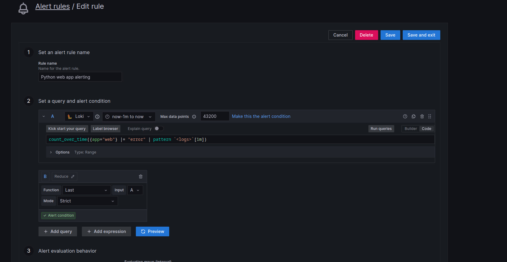

# Alerting on simple query


```go
count_over_time({app="web"} |= "error" | pattern `<logs>`[1m])
```
This expression checks logs from `app=web` and if there are `error` in log messages, then will be alert in Your Slack channel.

In `pattern` expr. use your custom pattern name, which you want to add in Notification Template file.

You Can see more about it in [Grafana Loki Documentation Page, in Log query Section.](https://grafana.com/docs/loki/latest/logql/log_queries/).

!

[Sources](.././Screens/Alert3.png)
Now, when your application returnet error messages in logs, your Alert manager sent Alert to your Slack Channel.
# Its look like this.
