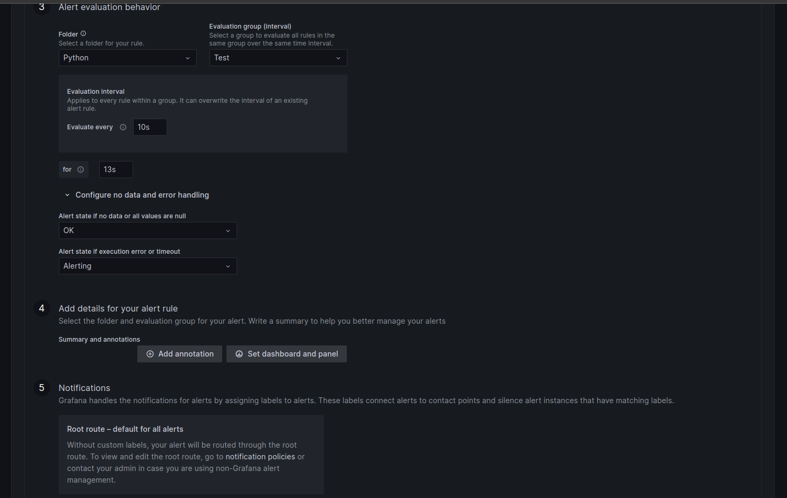

# Alerting on simple query

In `pattern` expr. use your custom pattern name, which you want to add in Notification Template file.

Now, when your application returnet error messages in logs, your Alert manager sent Alert to your Slack Chanel.
# Its look like this.
