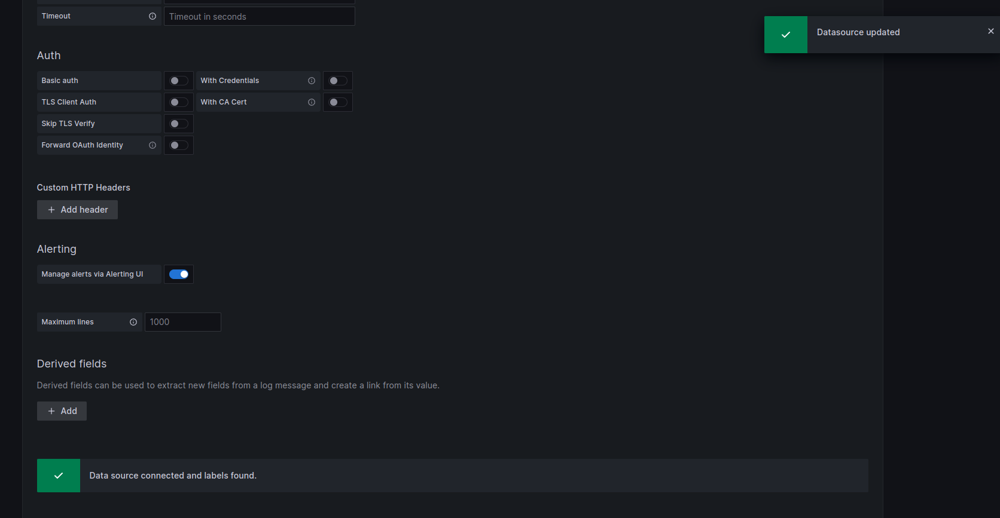

# Add Datasource for Grafana.

Navigate in DataSource Configuration Section.


Add new DataSource.


Select Loki.


* In URL Filed You must add loki url

```bash
http://loki-loki-distributed-gateway.<YOUR NAMESPACE>.svc.cluster.local
```


Save and test.

