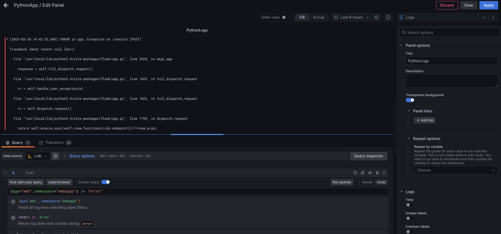
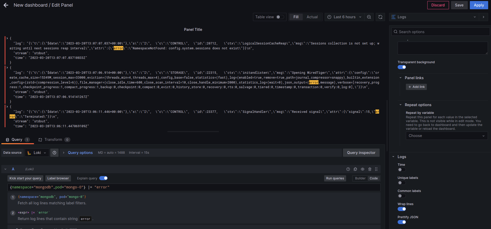

# Example how to view application logs.

After installation open Grafana UI page in your browser.
Next navigate in `Explore` tab. In here you can use queries for viewing your Kubernetes application's logs.
For example :
```bash
{app="web",namespace="webapps"} |="error"
```
In this example there are "Multiline" logs. Multiline stage configured in `values.yaml` file. You can see about Multiline stages in [Description](.././Documents).

Other example in "Singleline" mod.
```bash
{namespace="mongodb",pod="mongo-0"} |="error"
```


# Next step.
Now you can configure notification policy and template file for your alerts.
See more [in this page](.././NotificationPolicy/)