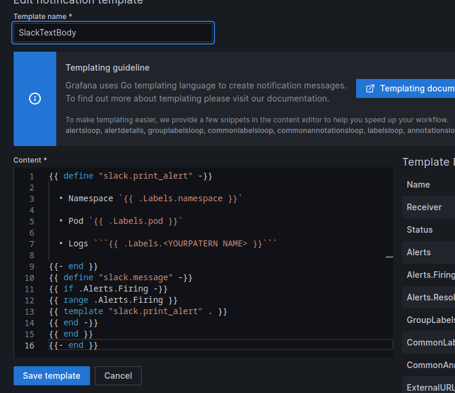
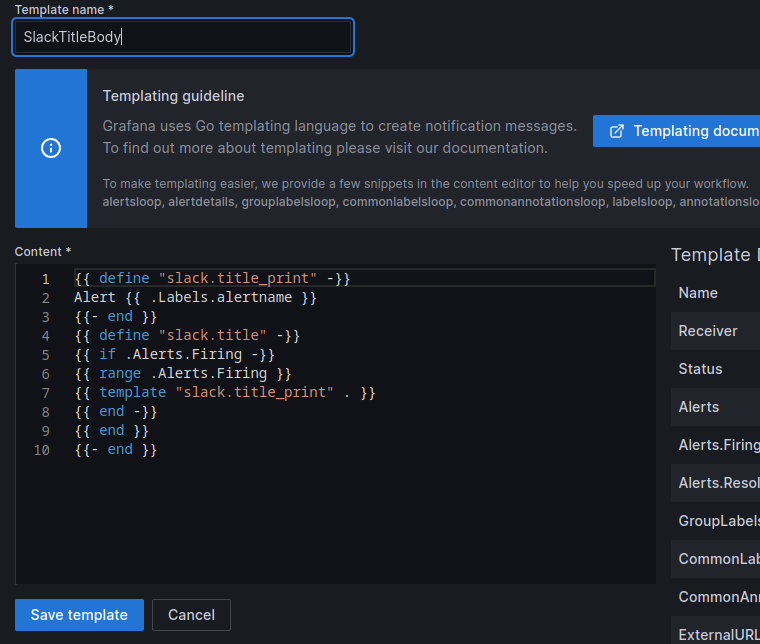
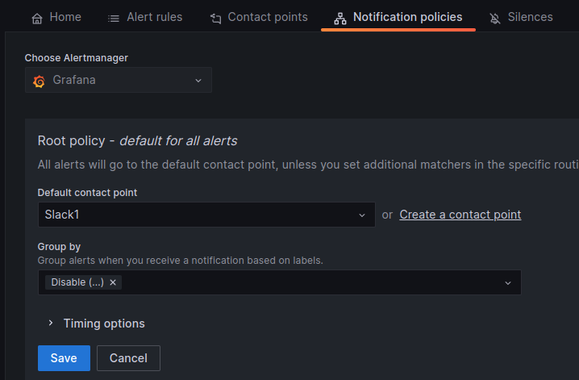

# Configuration notification policy and Notification Template for your Alerts.

Add your `ChannelID` and  API `token` or `webhook` url.


Add Title

```go
{{ template "slack.title" . }}
```
Add Text Body

```go
{{ template "slack.message" . }}
```
Add Notification template.




```go
{{ define "slack.print_alert" -}}

  • Namespace `{{ .Labels.namespace }}`

  • Pod `{{ .Labels.pod }}`

  • Logs ```{{ .Labels.<YOURPATERN NAME> }}```
  
{{- end }}
{{ define "slack.message" -}}
{{ if .Alerts.Firing -}}
{{ range .Alerts.Firing }}
{{ template "slack.print_alert" . }}
{{ end -}}
{{ end }}
{{- end }}
```


Add Title template in new Template file.

```go
{{ define "slack.title_print" -}}
Alert {{ .Labels.alertname }}
{{- end }}
{{ define "slack.title" -}}
{{ if .Alerts.Firing -}}
{{ range .Alerts.Firing }}
{{ template "slack.title_print" . }}
{{ end -}}
{{ end }}
{{- end }}
```

Edit Notification Policy, Select Your Contact Point and disable Grouping.



More about in [Grafana Documentation Page.](https://grafana.com/docs/grafana/latest/alerting/manage-notifications/template-notifications/create-notification-templates/)


# Pattern name is using in queries for sending log lines from log file.

# Alert example.
See more [in this page](.././AlertExample/README.md)