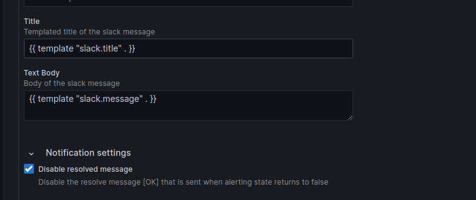

# Configuration notification policy and Notification Template for your Alerts.

Add your `ChanelID` and  API `token` or `webhook` url.



Add `Title`

```bash
ERRORS.
```
Add Text Body

```bash
{{ template "slack.message" . }}
```
Add Notification templates.


```bash
{{ define "slack.print_alert" -}}
Alert {{ .Labels.alertname }}
Namespace {{ .Labels.namespace }}
Pod {{ .Labels.pod }}
Logs {{ .Labels.<YOUR_PATTERN_NAME> }}
{{- end }}
{{ define "slack.message" -}}
{{ if .Alerts.Firing -}}
{{ len .Alerts.Firing }} firing alert(s):
{{ range .Alerts.Firing }}
{{ template "slack.print_alert" . }}
{{ end -}}
{{ end }}
{{- end }}
```
More about in [Grafana Documentation Page.](https://)


# Pattern name is using in queries for sending log lines from log file.

# Alert example.
See more [in this page](.././AlertExample/)